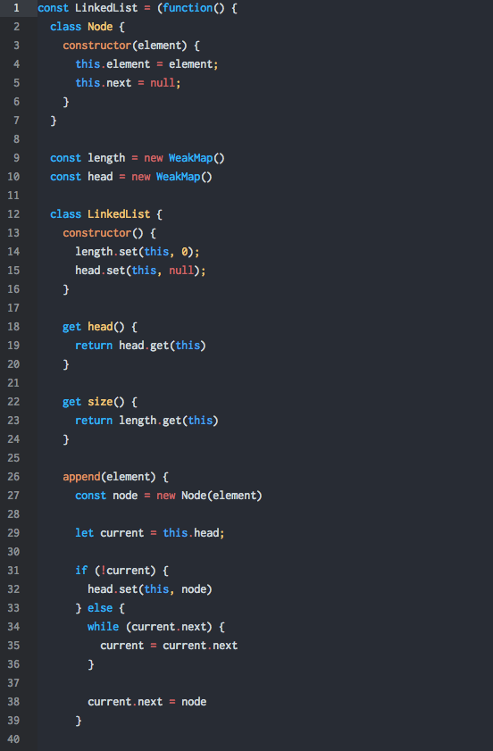

# atom-web-syntax

This is a minimalistic syntax for web development which focus heavily on javascript

Based on original Atom color and added google material design color



## Getting Started
Install via apm

```
apm install atom-web-syntax
```

Install via Atom editor
1. Open Preferences/Settings
2. Click Install > Themes
3. Search for `Atom Web Syntax` and install
